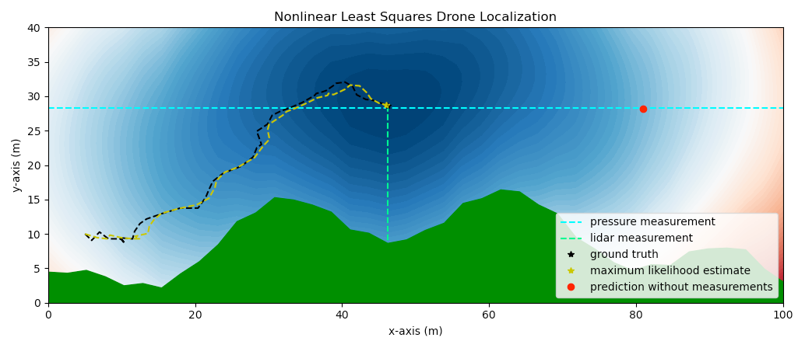

# UAV Sensor Fusion Research

## Summary

This is the directory to use the planar drone simulator used to perform state estimation in GPS denied environments but with a known map. The model assumes:
1. two-dimensional world
2. known map
3. Gaussian process and measurement noise
4. pressure measurement
5. height above ground measurement.

With these three metrics, the drone is able to localize itself by solving a nonlinear least squares problem with the [Gauss-Newton algorithm](https://en.wikipedia.org/wiki/Gauss%E2%80%93Newton_algorithm). The blue/red contour lines represent the gradient that is decended inorder to minimize the cost function. The solution represents the most likely location given different variances on the process and measurement noise.

## Setup
1. install [Poetry](https://python-poetry.org/docs/#installation)
2. `git clone https://github.com/Tsmorz/uav-sensor-fusion.git`
3. `make init` to set up the virtual environment
4. `poetry shell` to activate the virtual environment

## Running
`python src/main.py` if you're virtual environment is active or `poetry run python src/main.py` if it isn't

## Adding to the repo
1. When wanting to make new changes, please create a new branch first:\
`git checkout -b new-branch-name`

2. While making changes in your new branch, keep track of changes with:\
`git add file_that_changed`\
`git commit -m "a useful message"`\
`git push`

3. With new functionality, please create new unit and integration tests to make development easier in the future. Your tests should be added to the `tests` directory.
Tests should be run with: `make test`
